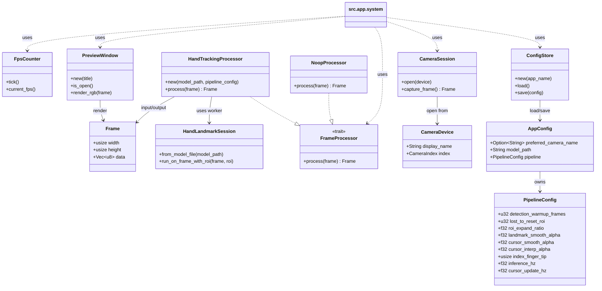

# Architecture Overview

このリポジトリは Web カメラ入力を起点に、ONNX Runtime 推論とカーソル制御をつないだリアルタイム処理基盤です。

## モジュール一覧と役割

- src.main: エントリポイント。`app::run()` を呼び出して処理を開始。
- src.app: アプリ全体のライフサイクルを管理。設定読込、カメラ選択、処理パイプライン起動、FPS表示を実行。
- src.preferences: TOML設定の永続化。`AppConfig` と `PipelineConfig` のデフォルト値と保存先解決を提供。
- src.camera: 利用可能カメラの列挙とセッション管理。RGBフレーム取得を担当。
- src.inference: ONNX Runtime セッション管理。フレーム（またはROI）を入力して 21 点ランドマークを推論。
- src.pipeline: 推論ワーカーと描画・平滑化・ROI追跡・カーソル移動を統合するリアルタイム処理層。
- src.ui: カメラ選択UIとプレビューウィンドウ表示（minifb）を提供。

## 設計原則

- 主従関係: `app::run()` が制御を持ち、1フレーム単位で `camera -> pipeline -> ui` を駆動。
- 障害耐性: 推論初期化失敗時は `NoopProcessor` にフォールバックしてプレビューを継続。
- 性能: 推論は専用ワーカーへ分離し、メインループはノンブロッキングで結果を吸収。
- 拡張性: `FrameProcessor` トレイト境界で処理系を差し替え可能。

## クラス図（概要）

