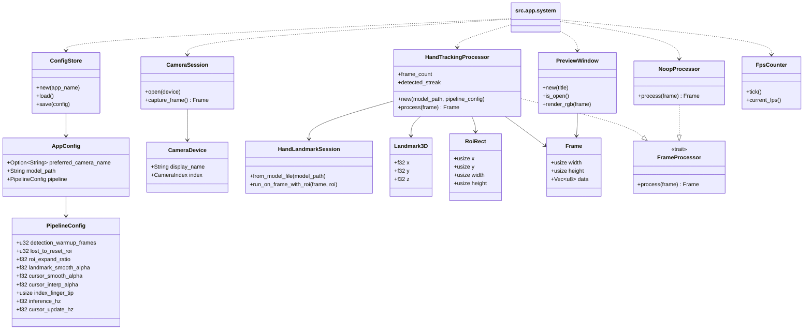

# クラス図（詳細）

手ランドマーク推論とカーソル制御を中心にした主要クラス構成。

```mermaid
classDiagram
    class ConfigStore {
        +new(app_name)
        +load()
        +save(config)
    }

    class AppConfig {
        +Option~String~ preferred_camera_name
        +String model_path
        +PipelineConfig pipeline
    }

    class PipelineConfig {
        +u32 detection_warmup_frames
        +u32 lost_to_reset_roi
        +f32 roi_expand_ratio
        +f32 landmark_smooth_alpha
        +f32 cursor_smooth_alpha
        +f32 cursor_interp_alpha
        +usize index_finger_tip
        +f32 inference_hz
        +f32 cursor_update_hz
    }

    class CameraDevice {
        +String display_name
        +CameraIndex index
    }

    class CameraSession {
        +open(device)
        +capture_frame() Frame
    }

    class HandLandmarkSession {
        +from_model_file(model_path)
        +run_on_frame_with_roi(frame, roi)
    }

    class Landmark3D {
        +f32 x
        +f32 y
        +f32 z
    }

    class RoiRect {
        +usize x
        +usize y
        +usize width
        +usize height
    }

    class Frame {
        +usize width
        +usize height
        +Vec~u8~ data
    }

    class FrameProcessor {
        <<trait>>
        +process(frame) Frame
    }

    class HandTrackingProcessor {
        +new(model_path, pipeline_config)
        +process(frame) Frame
        +frame_count
        +detected_streak
    }

    class NoopProcessor {
        +process(frame) Frame
    }

    class PreviewWindow {
        +new(title)
        +is_open()
        +render_rgb(frame)
    }

    class FpsCounter {
        +tick()
        +current_fps()
    }

    ConfigStore --> AppConfig
    AppConfig --> PipelineConfig
    CameraSession --> CameraDevice
    HandTrackingProcessor ..|> FrameProcessor
    NoopProcessor ..|> FrameProcessor
    HandTrackingProcessor --> HandLandmarkSession
    HandTrackingProcessor --> Landmark3D
    HandTrackingProcessor --> RoiRect
    HandTrackingProcessor --> Frame
    PreviewWindow --> Frame
    src.app.system ..> ConfigStore
    src.app.system ..> CameraSession
    src.app.system ..> HandTrackingProcessor
    src.app.system ..> NoopProcessor
    src.app.system ..> PreviewWindow
    src.app.system ..> FpsCounter
```

図は docs/architecture.md と整合しています。