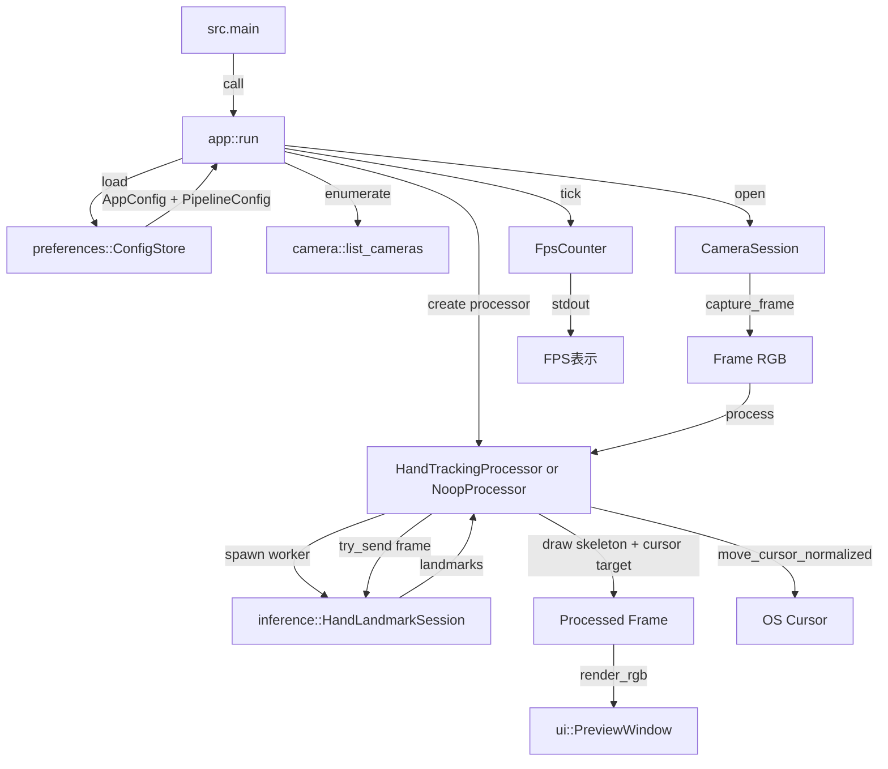

# Data Flow

データの流れ（入力 → 学習ループ → 出力）を示します。

- 入力: Webカメラ映像（RGBフレーム）
- 設定読込: ConfigStore が TOML 設定をロードし、未存在時はデフォルト値を適用
- 実行主体: app::run() のメインループがフレーム取得と描画を駆動
- 推論処理: HandTrackingProcessor が推論ワーカーへフレーム送信し、ランドマーク結果を非同期反映
- 出力処理: 骨格描画済みフレームを PreviewWindow へ表示し、同時に正規化座標でOSカーソルを移動
- 失敗時挙動: 推論セッション生成失敗時は NoopProcessor が生フレーム表示を継続

実運用の主経路は `CameraSession -> FrameProcessor -> PreviewWindow` です。推論処理はワーカー分離され、UI更新をブロックしない構成です。