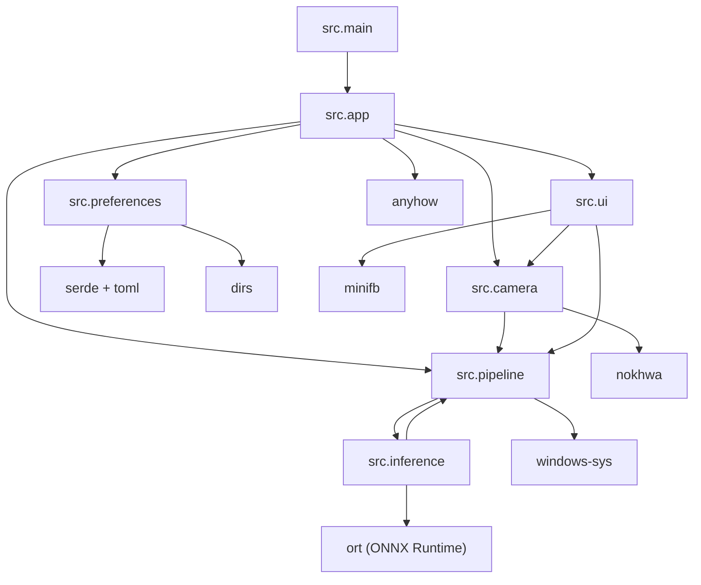

# モジュール依存関係

プロジェクト内部のモジュール依存を示します。

- 循環依存はない。主経路は main → app → (camera/pipeline/ui/preferences)。
- 推論層は pipeline 経由でのみ利用し、UI層から inference へ直接依存しない。
- OSカーソル制御は pipeline 内に閉じ、`windows-sys` 依存の影響範囲を限定している。
